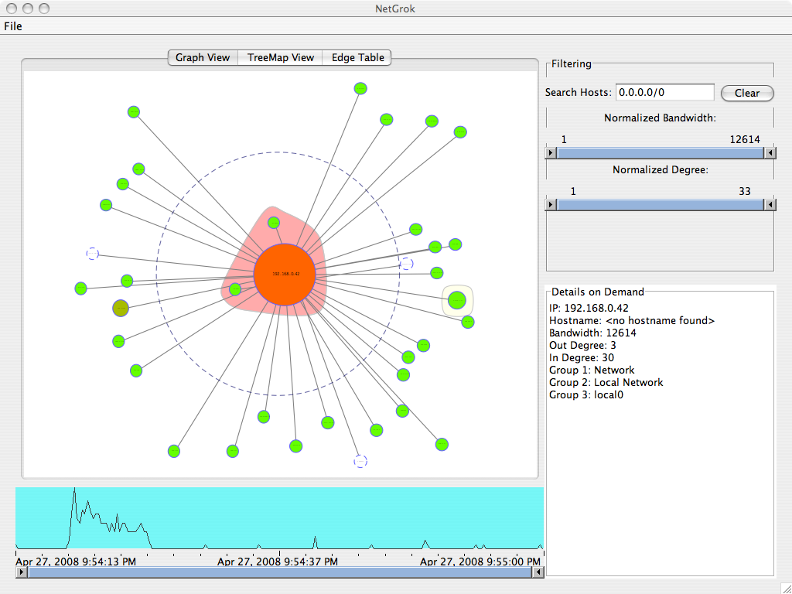

# NetGrok

**NetGrok Members:** Lucas Cobb, Moise David, Jayleene Perez, and Son Tran

## Purpose
NetGrok aims to create a way in which one can visually diagnose the activity of a network in real-time. Eventually leading to simple interface that anyone can use to monitor how many resources are being used in their network.

## How to use
